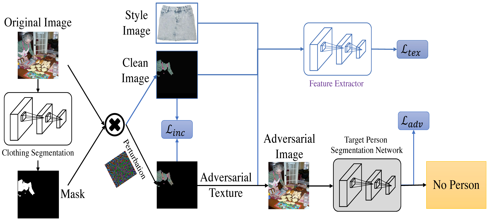

# FashionAdv: Fashion-Guided Adversarial Attack on Person Segmentation

<div align="center">

[](https://cvpr2021.thecvf.com/)
[](https://arxiv.org/abs/your-paper-id)
[](LICENSE)
[](https://www.python.org/downloads/)
[](https://pytorch.org/)

*The first adversarial attack method specifically designed for person segmentation networks*

</div>

## 🎯 Overview

**FashionAdv** introduces a novel approach to adversarial attacks on person segmentation networks by synthesizing natural-looking clothing textures that can make persons invisible to deep learning models. Unlike traditional adversarial attacks that modify entire images, FashionAdv strategically targets only clothing regions, maintaining image quality while achieving robust performance against various transformations.

  

## ✨ Key Features

- 🎨 **Fashion-Guided**: Leverages fashion style images to generate natural-looking adversarial textures
- 🎯 **Targeted Attack**: Focuses only on clothing regions, minimizing impact on overall image quality
- 🛡️ **Robust**: Resistant to JPEG compression, image filtering, and various transformations
- 👁️ **Imperceptible**: Changes are inconspicuous to human observers
- 🚀 **SOTA Performance**: Significantly outperforms conventional adversarial methods

## 📊 Performance Highlights

| Method | No Compression | QF 80 | QF 40 | QF 10 |
|--------|---------------|-------|-------|-------|
| FGSM | 49.71 | 51.33 | 52.90 | 43.30 |
| ColorFool | 46.14 | 50.65 | 50.41 | 33.77 |
| **FashionAdv** | **18.40** | **19.90** | **20.49** | **20.82** |

*Lower AP scores indicate better attack success.*

## 🔧 Installation

### Prerequisites
```bash
# Clone the repository
git clone https://github.com/marc-treu/FashionAdv.git
cd FashionAdv

# Create conda environment
conda create -n fashionadv python=3.7
conda activate fashionadv
```

### Dependencies
```bash
# Install PyTorch (adjust CUDA version as needed)
conda install pytorch torchvision torchaudio cudatoolkit=11.0 -c pytorch

# Install other requirements
pip install -r requirements.txt

# Install additional dependencies
pip install opencv-python pillow matplotlib tqdm
pip install pytorch-msssim kornia
```

## 📁 Dataset Preparation

### MS-COCO Dataset
```bash
# Download MS-COCO validation set
wget http://images.cocodataset.org/zips/val2017.zip
wget http://images.cocodataset.org/annotations/annotations_trainval2017.zip

# Extract to appropriate directories
unzip val2017.zip -d data/coco/
unzip annotations_trainval2017.zip -d data/coco/
```

### Fashion Style Corpus
Our curated fashion style corpus contains 140 distinct clothing patterns selected from DeepFashion2 dataset.

```bash
# Download pre-processed fashion corpus
wget [LINK_TO_FASHION_CORPUS] -O fashion_corpus.zip
unzip fashion_corpus.zip -d Instance_Segmentation_Attack/data/
```

### Human Parsing Masks
We use SCHP (Self-Correction for Human Parsing) to generate clothing region masks.

```bash
# Download pre-computed masks for MS-COCO validation set
wget [LINK_TO_MASKS] -O clothing_masks.zip
unzip clothing_masks.zip -d Instance_Segmentation_Attack/data/mask_upper_shirt/
```

## 🚀 Quick Start

### Basic Attack
```python
import torch
from fashionAdv import fashionAdv_attack

# Load target image
content_index = 0  # Index in MS-COCO dataset

# Attack configuration
attack_setup = {
    'max_iter': 200,
    'lr': 0.02,
    'adv_loss_weight': 1,
    'textural_loss_weight': 200000,
    'ssim_loss_weight': 50,
    'tv_loss_weight': 0.00025,
}

# Generate adversarial example
adversarial_image = fashionAdv_attack(content_index, attack_setup)
```

### Command Line Usage
```bash
# Attack images 0-99 from the dataset
python fashionAdv.py 0 100

# Attack specific range
python fashionAdv.py 500 600
```

## 📖 Method Details

### Architecture Overview
FashionAdv consists of four main components:

1. **Clothing Segmentation**: Uses SCHP to identify attackable regions
2. **Style Selection**: Automatically selects optimal fashion style from corpus
3. **Adversarial Optimization**: Generates robust adversarial textures
4. **Robustness Training**: Uses EOT framework for transformation invariance

### Loss Function
Our total loss combines adversarial and naturalness objectives:

```
L_total = α·L_adv + L_nat
L_nat = L_inc + β·L_tex
```

Where:
- `L_adv`: Adversarial loss (classification + segmentation)
- `L_inc`: Inconspicuous loss (MS-SSIM + TV)
- `L_tex`: Texture transfer loss (content + style)

### Robustness Training
We simulate real-world conditions with:
- **Perspective transformation**: Random homography matrices
- **Gaussian blur**: Various kernel sizes and sigma values
- **Color jittering**: HSV adjustments
- **Noise addition**: Uniform noise injection
- **JPEG compression**: Quality factors 18-22

## 📊 Results

### Attack Success Rate
- **Uncompressed**: 18.40 AP (↓26.16% vs. best baseline)
- **JPEG QF 10**: 20.82 AP (↓33.14% vs. best baseline)

### Visual Quality
- **SSIM**: 0.958 (near-perfect structural similarity)

## 🛠️ Configuration

### Attack Parameters
Key hyperparameters in `attack_setup`:

```python
attack_setup = {
    'max_iter': 200,           # Optimization iterations
    'lr': 0.02,               # Learning rate
    'adv_loss_weight': 1,     # Adversarial loss weight
    'textural_loss_weight': 200000,  # Texture loss weight
    'ssim_loss_weight': 50,   # SSIM loss weight
    'tv_loss_weight': 0.00025,  # Total variation weight
    
    # Robustness training probabilities
    'apply_color_manipulation': 0.5,
    'apply_transform': 0.5,
    'apply_gaussian': 0.25,
    'apply_jpeg': 0.75,
}
```

### Style Corpus Customization
Add your own fashion styles:
```python
# Add new style image
new_style_path = 'path/to/your/style.jpg'
style_corpus.add_style(new_style_path)

# Recompute texture costs
compute_texture_costs(target_images, style_corpus)
```

## 📚 Citation

If you use FashionAdv in your research, please cite our paper:

```bibtex
@Inproceedings{marc-CVPRW2021,
  Title          = {Fashion-Guided Adversarial Attack on Person Segmentation},
  Author         = {Marc Treu and Trung-Nghia Le and Huy H. Nguyen and Junichi Yamagishi and Isao Echizen},
  BookTitle      = {Conference on Computer Vision and Pattern Recognition Workshops},
  Year           = {2021},
}
```

## 👥 Authors

- **Marc Treu** - Sorbonne University, France
- **Trung-Nghia Le** - National Institute of Informatics, Japan  
- **Huy H. Nguyen** - National Institute of Informatics, Japan
- **Junichi Yamagishi** - NII, Japan & SOKENDAI, Japan
- **Isao Echizen** - NII, Japan & University of Tokyo, Japan

## 📄 License

This project is licensed under the MIT License - see the [LICENSE](LICENSE) file for details.

## 🔗 Related Work

- [YOLACT: Real-time Instance Segmentation](https://github.com/dbolya/yolact)
- [Self-Correction for Human Parsing](https://github.com/PeikeLi/Self-Correction-Human-Parsing)
- [Unrestricted Adversarial Examples](https://github.com/microsoft/unrestricted-adversarial-examples)


<div align="center">
  <p>⭐ Star this repository if you find it helpful!</p>
  <p>🐛 Found a bug? Please <a href="https://github.com/marc-treu/FashionAdv/issues">open an issue</a></p>
</div>
